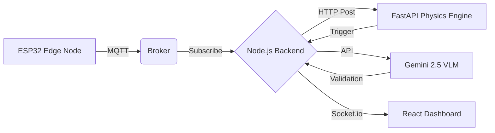
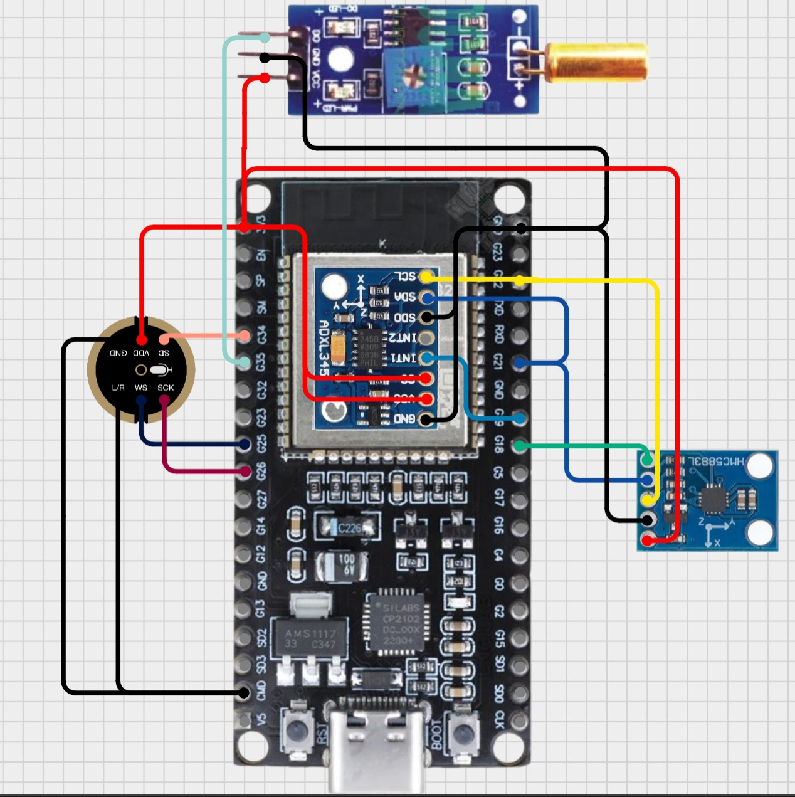
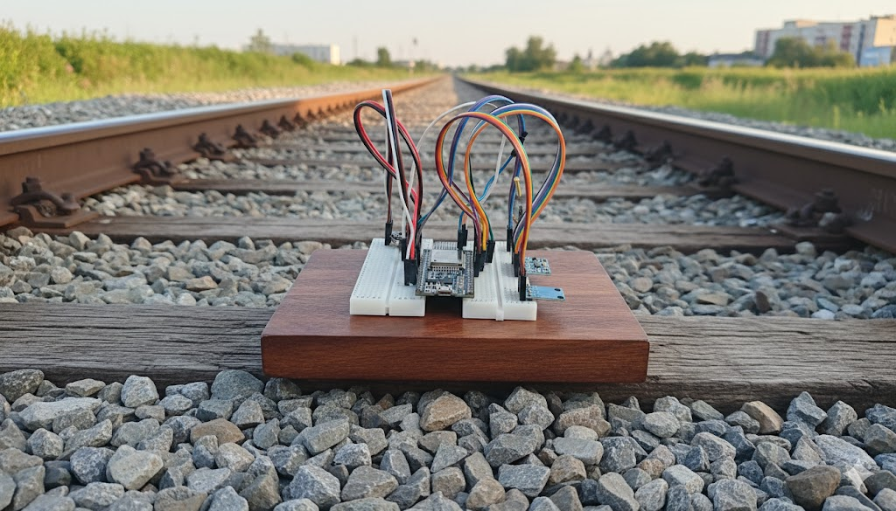
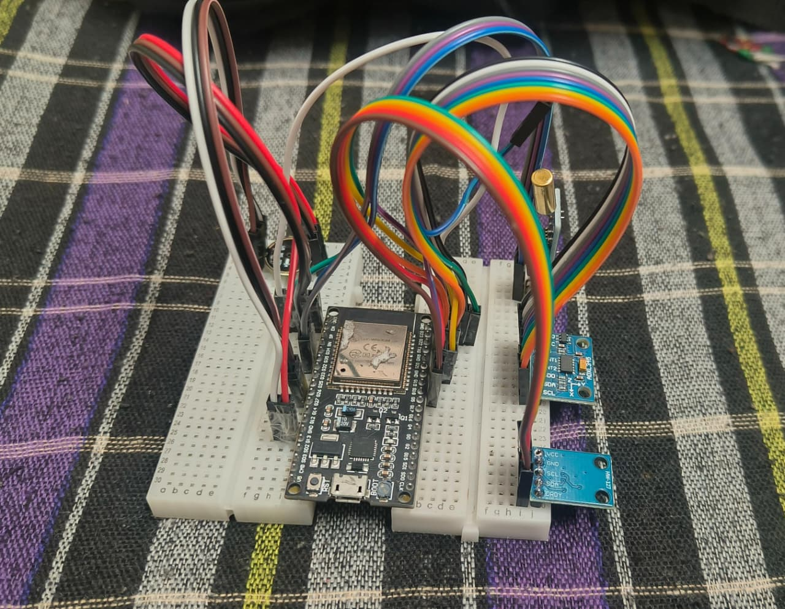
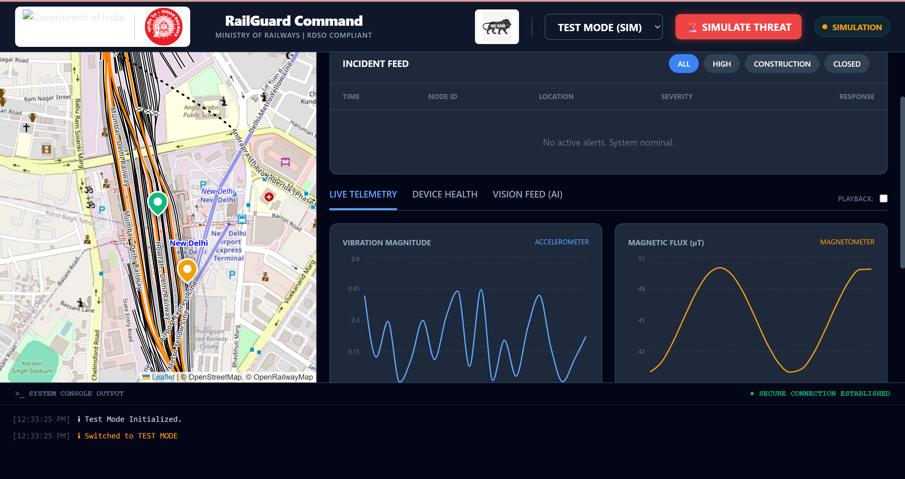
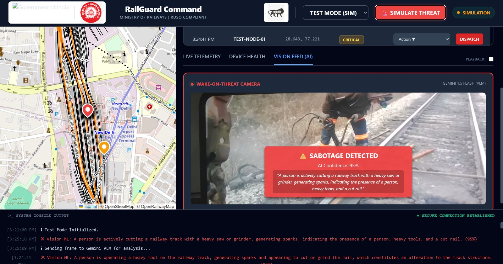

Here is the complete, updated code for your `README.md` file. 

[cite_start]I have updated the repository URL to match the exact GitHub link from your presentation (`thesurajarya/hack4delhi.git`) [cite: 253] so it is completely ready to copy, paste, and push!

```markdown
<div align="center">

  
  
  

  <br/><br/>

  # RailGuard Command Center
  ### AI-Powered Real-Time Railway Sabotage Detection System

  <p>
    <a href="#-problem-statement">Problem</a> •
    <a href="#-system-architecture">Architecture</a> •
    <a href="#-prototype-in-action">Prototype</a> •
    <a href="#-tech-stack">Tech Stack</a> •
    <a href="#-installation--setup">Setup</a>
  </p>

  
  
  
  
  

</div>

---

## 🚨 Problem Statement

Railway safety is critical, yet infrastructure is often compromised by sabotage, theft, or tampering. Traditional inspection methods are reactive and intermittent. **RailGuard** provides a **proactive** solution to:

* **Detect** physical tampering (sawing, hammering, removal) in real-time.
* **Analyze** multi-sensor data using Edge AI and Cloud Vision-Language Models (VLMs).
* **Alert** operators instantly via a geospatial dashboard with visual evidence.

---

## 🧠 System Architecture

The system follows a linear data pipeline from the physical edge to the operator dashboard, culminating in a "Wake-on-Threat" visual validation.



> **Flow:** Sensors → MQTT Broker → Node Server → Physics Inference → Wake Camera → VLM Validation → Dashboard UI

---

## 📸 Prototype in Action

<table>
  <tr>
    <td align="center"><strong>Hardware: ESP32 Edge Node</strong></td>
    <td align="center"><strong>Hardware: Field Deployment</strong></td>
  </tr>
  <tr>
    <td></td>
    <td></td>
  </tr>
  <tr>
    <td align="center"><strong>Software: Live Telemetry Dashboard</strong></td>
    <td align="center"><strong>Software: VLM Sabotage Detection</strong></td>
  </tr>
  <tr>
    <td></td>
    <td></td>
    <td></td>
  </tr>
</table>

---

## 🛠 Tech Stack

| Domain | Technology | Description |
| --- | --- | --- |
| **Hardware** | `ESP32 / ADXL345` | Edge node collecting Vibration, Magnetic (QMC5883L) & Sound (INMP441) data. |
| **Backend** | `Node.js / Express` | Server acting as the bridge between MQTT, AI, and Frontend. |
| **AI Engine** | `FastAPI / Gemini` | Physics-based rules for initial anomaly trigger, followed by VLM visual validation. |
| **Frontend** | `React / Vite` | Dashboard with Leaflet Maps (OpenRailwayMap) & Recharts for live telemetry. |
| **Comms** | `MQTT / WebSockets`| Low-latency protocol for IoT sensor data transmission to UI. |

---

## ⚙️ Installation & Setup

Follow these steps to set up the system locally.

### Prerequisites

* **Node.js** (v16 or higher)
* **Python** (v3.9 or higher)
* **Git**
* **Arduino IDE** (If deploying to physical hardware)

### 1️⃣ Clone the Repository

```bash
git clone [https://github.com/thesurajarya/hack4delhi.git](https://github.com/thesurajarya/hack4delhi.git)
cd hack4delhi
```

### 2️⃣ Backend Setup (Node.js)

The backend handles MQTT subscriptions, WebSockets, and Gemini API calls.

```bash
cd Software/backend/node-server
npm install
# Create a .env file and add your GEMINI_API_KEY
```

### 3️⃣ AI Service Setup (Python)

The intelligence layer that processes raw sensor physics.

```bash
cd Software/backend/node-server/ai-service
pip install -r requirements.txt
```

### 4️⃣ Frontend Setup (React)

The command center dashboard.

```bash
cd Software/frontend
npm install
```

---

## 🚀 How to Run

To run the full system, you need **three separate terminal windows**.

#### Terminal 1: The Brain (AI Service)
```bash
cd Software/backend/node-server/ai-service
python -m uvicorn dataextract:app --reload --port 5000
```
> *Output:* `AI Model Loaded Successfully`

#### Terminal 2: The Bridge (Node Backend)
```bash
cd Software/backend/node-server
node index.js
```
> *Output:* `RailGuard Backend Active` and `Connected to MQTT Broker`

#### Terminal 3: The Interface (Dashboard)
```bash
cd Software/frontend
npm run dev
```
> *Output:* `➜ Local: http://localhost:5173/`

---

## 🧪 Testing the System

1. **Open Dashboard:** Navigate to `http://localhost:5173`.
2. **Select Mode:** Choose **TEST MODE (SIM)** from the header dropdown.
3. **Simulate Threat:** Click the red `🚨 SIMULATE THREAT` button. The camera will wake up, snap a photo, and send it to the VLM.
4. **Hardware Test:** If using ESP32, switch to **LIVE SENSORS** mode and shake the sensor violently to trigger the edge-to-cloud alert pipeline.

---

<div align="center">
<b>Built for Hack4Delhi / Railway Safety Projects 🇮🇳</b>

<br/>

<sub>RDSO Compliant Logic • Indigenous Technology • Make in India</sub>
</div>
```
